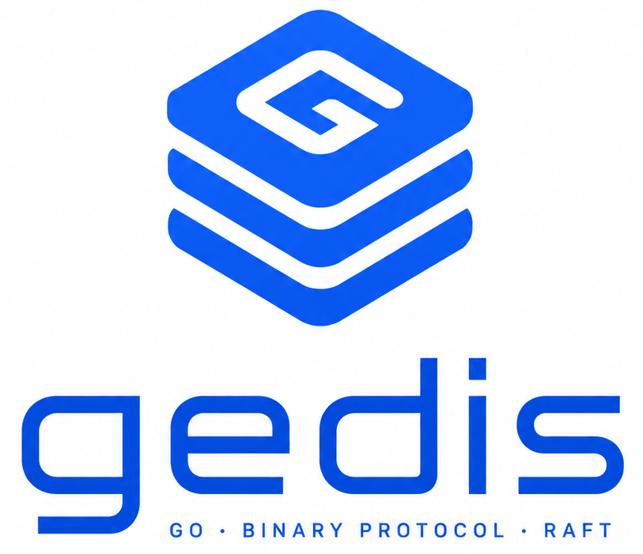

# Gedis



Gedis is an in-memory key-value database exposed through a persistent binary TCP protocol. It supports byte-oriented keys and values, per-key expiration, standalone persistence, and optional Raft replication.

## Concepts

### Keys and values

Keys are 16 bytes hashes. The client accepts an array of volatile lenght, computes its 16 bytes hash and use it as a key
Values are arbitrary byte sequences.

### Expiration

Some keys can have expiration - the time in which the key will be deleted.

### Mutations and reads

The database supports:

- `Set`: create or replace a value
- `Get`: return a value
- `Del`: remove a value
- `Exist`: test for a value
- `TTLSet`: set expiration in seconds
- `TTLGet`: return remaining expiration
- `TTLDel`: remove expiration without removing the value

## Deployment Modes

### Standalone

Standalone mode is the default:

```text
GEDIS_RAFT_ENABLED=0
```

Mutate directly against the local database. A standalone snapshot is loaded at
startup and written atomically at the configured interval:

```text
GEDIS_SNAPSHOT_PATH    snapshot file (used only when GEDIS_RAFT_ENABLED=0)
```

The default snapshot path is `./gedis.snap`.

### Raft

Raft mode is enabled with:

```text
GEDIS_RAFT_ENABLED=1
```

Mutations are accepted by the leader, committed through Raft, and applied by the finite-state machine on every member. Followers return `NotLeader` for mutations and may include the current leader address in the response body.

A Raft deployment stores:

```text
GEDIS_RAFT_LOG_PATH                 durable Raft log file
GEDIS_RAFT_STABLE_STORE_PATH        Raft stable-state file
GEDIS_RAFT_SNAPSHOTS_DIR_PATH       Raft snapshot directory
```

Raft snapshots contain values and TTL metadata. The log is compacted according to the snapshot and trailing-log settings.

## Server Configuration

Configuration is supplied through environment variables.

### Network and process

| Variable                        | Default | Description                                    |
| ------------------------------- | ------- | ---------------------------------------------- |
| `GEDIS_ADDRESS`                 | `:8080` | Client TCP listen address                      |
| `GEDIS_RECEIVE_TIMEOUT`         | `3s`    | Maximum request read time after the first byte |
| `GEDIS_SEND_TIMEOUT`            | `3s`    | Maximum response write time                    |
| `GEDIS_TCP_PING_INTERVAL`       | `30s`   | Configured TCP keep-alive interval             |
| `GEDIS_VERBOSITY`               | `2`     | `0`: error, `1`: warn, `2`: info, `3`: debug   |
| `GEDIS_ENTRY_CHECKS_PER_SECOND` | `200`   | TTL entries examined per second                |

### Persistence

| Variable                        | Default                          | Type      | Description                                                         |
| ------------------------------- | -------------------------------- | --------- | ------------------------------------------------------------------- |
| `GEDIS_SNAPSHOT_PATH`           | `/var/lib/gedis/db.snap`         | File      | Standalone snapshot (used only when `GEDIS_RAFT_ENABLED=0`)         |
| `GEDIS_RAFT_LOG_PATH`           | `/var/lib/gedis/raft/aof.log`    | File      | Durable Raft log                                                    |
| `GEDIS_RAFT_STABLE_STORE_PATH`  | `/var/lib/gedis/raft/stable.db`  | File      | Raft term, vote, and configuration state                            |
| `GEDIS_RAFT_SNAPSHOTS_DIR_PATH` | `/var/lib/gedis/raft/snapshots/` | Directory | Raft FSM snapshot directory (used only when `GEDIS_RAFT_ENABLED=1`) |

The server creates missing parent directories for configured persistence paths.
TTL_Expire

### Raft identity and topology

| Variable                    | Default | Description                                 |
| --------------------------- | ------- | ------------------------------------------- |
| `GEDIS_RAFT_ENABLED`        | `0`     | Enable Raft replication                     |
| `GEDIS_RAFT_NODE_ID`        | empty   | Node identity used in startup logs          |
| `GEDIS_RAFT_ADDRESS`        | `:7000` | Raft transport address and server ID source |
| `GEDIS_RAFT_PEER_ADDRESSES` | empty   | Comma-separated Raft transport addresses    |

### Raft timing and compaction

| Variable                          | Default | Description                                              |
| --------------------------------- | ------- | -------------------------------------------------------- |
| `GEDIS_RAFT_HEARTBEAT_INTERVAL`   | `100ms` | Leader heartbeat interval                                |
| `GEDIS_RAFT_ELECTION_TIMEOUT_MIN` | `300ms` | Election timeout applied to Raft                         |
| `GEDIS_RAFT_ELECTION_TIMEOUT_MAX` | `600ms` | Loaded setting; HashiCorp Raft uses one election timeout |
| `GEDIS_RAFT_REPLICATION_TIMEOUT`  | `1s`    | Client mutation commit wait                              |
| `GEDIS_RAFT_COMMIT_TIMEOUT`       | `5ms`   | Raft commit batching timeout                             |
| `GEDIS_RAFT_SNAPSHOT_INTERVAL`    | `10m`   | Snapshot check interval                                  |
| `GEDIS_RAFT_SNAPSHOT_THRESHOLD`   | `8192`  | New entries required before snapshot                     |
| `GEDIS_RAFT_TRAILING_LOGS`        | `1024`  | Entries retained after snapshot                          |
| `GEDIS_RAFT_MAX_APPEND_ENTRIES`   | `64`    | Maximum entries in one append batch                      |

Durations use Go syntax such as `5ms`, `1s`, and `10m`.

## Single-Node Raft

Use Raft persistence without peer replication by setting `GEDIS_RAFT_ENABLED=1`, configuring `GEDIS_RAFT_ADDRESS`, and leaving `GEDIS_RAFT_PEER_ADDRESSES` empty. This is useful when Raft log and FSM recovery are desired on one server.

## Cluster Deployment

Each member needs:

- A unique reachable `GEDIS_RAFT_ADDRESS`.
- A unique `GEDIS_RAFT_NODE_ID`.
- The same `GEDIS_RAFT_PEER_ADDRESSES` list.
- Separate local values for `GEDIS_RAFT_LOG_PATH`, `GEDIS_RAFT_STABLE_STORE_PATH`, and `GEDIS_RAFT_SNAPSHOTS_DIR_PATH`.

Example node configuration:

```text
GEDIS_ADDRESS=10.0.0.1:8080
GEDIS_RAFT_ENABLED=1
GEDIS_RAFT_NODE_ID=node-1
GEDIS_RAFT_ADDRESS=10.0.0.1:7000
GEDIS_RAFT_PEER_ADDRESSES=10.0.0.1:7000,10.0.0.2:7000,10.0.0.3:7000
GEDIS_RAFT_LOG_PATH=/var/lib/gedis/node-1/aof.log
GEDIS_RAFT_STABLE_STORE_PATH=/var/lib/gedis/node-1/stable.db
GEDIS_RAFT_SNAPSHOTS_DIR_PATH=/var/lib/gedis/node-1/snapshots
```

Clients should send mutations to the leader. When a client receives `NotLeader`, it can use the returned address or apply its own service discovery policy.

## Protocol

The server uses a persistent TCP protocol with fixed headers and optional bodies. See [`docs/protocol.md`](docs/protocol.md) for the wire format and status codes. Application code should normally use the Go client rather than implementing the protocol directly.

## Documentation

- [`docs/protocol.md`](docs/protocol.md): wire protocol reference
- [`docs/architecture.md`](docs/architecture.md): server internals and state flow
- [`docs/development.md`](docs/development.md): build, test, benchmark, and contribution workflow
